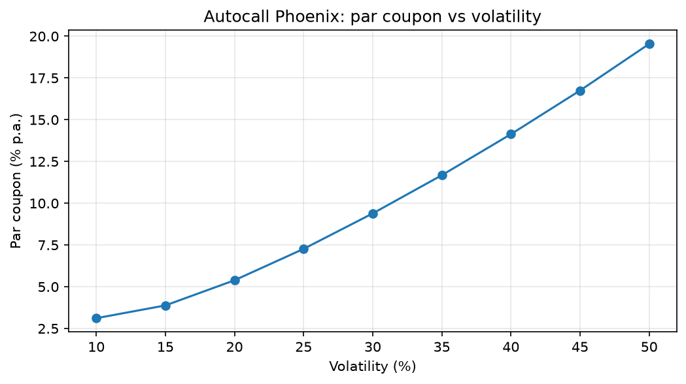
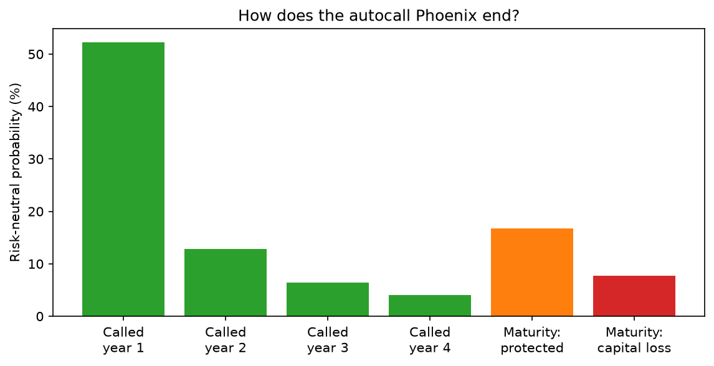
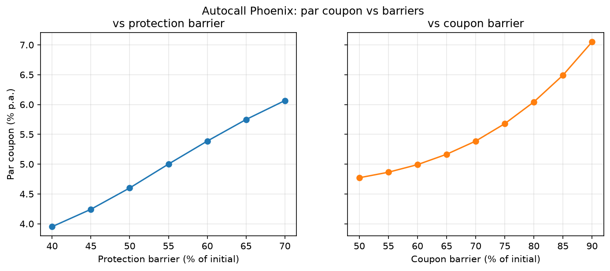

# Structured Products Pricer

A Python toolkit for pricing structured products the way a structuring desk does: break the
payoff into simpler pieces, price it, solve for the coupon, then study how the product behaves.

The equity module covers vanilla options, the Reverse Convertible and the autocall Phoenix.
It is on hold while I work on the credit module (CDS pricing, a default probability curve and
the Credit-Linked Note); its remaining items are in the roadmap.

The [autocall walkthrough notebook](notebooks/equity/autocall_walkthrough.ipynb) goes through
the product, the pricing method, the validation and the results.

The [CDS walkthrough notebook](notebooks/credit/cds_walkthrough.ipynb) goes from market CDS
spreads to a hazard rate curve, survival probabilities, the two CDS legs and the par spread.

## Products

### Equity
| Product | Method | Status |
|---|---|---|
| European call and put | Black-Scholes closed form, Monte Carlo, put-call parity | Done |
| Reverse Convertible | Closed form (zero-coupon bond minus a put), Monte Carlo check, par coupon | Done |
| Autocall Phoenix | Monte Carlo on observation dates (autocall, memory coupon, protection barrier), par coupon solver | Done |
| Worst-of autocall | Correlated GBM on several underlyings (Cholesky) | Planned |
| Capital-protected note | Zero-coupon bond plus call participation | Planned |

### Credit
| Product | Method | Status |
|---|---|---|
| Credit default swap | Piecewise-constant hazard rate, premium and protection legs, par spread, upfront, value | Done |
| Default probability curve | Hazard rates bootstrapped from market CDS spreads | Done |
| Credit-Linked Note | Bond plus a CDS sold on a reference entity, par coupon | In Progess |

## Roadmap

### Equity
- [x] Monte Carlo engine validated against Black-Scholes
- [x] Reverse Convertible: Monte Carlo vs closed form, par coupon
- [x] Autocall Phoenix and par coupon solver
- [x] Walkthrough notebook: par coupon sensitivities and product life statistics
- [ ] Greeks (delta, gamma, vega) with common random numbers, behaviour near the barrier
- [ ] Interactive Streamlit app (live demo)
- [ ] Worst-of on 3 underlyings and the effect of correlation on the coupon
- [ ] Effect of skew, local volatility and dividends on autocall pricing

### Credit
- [x] CDS pricing with a constant hazard rate
- [x] Default probability curve bootstrapped from CDS spreads
- [x] CS01 and jump-to-default
- [ ] Credit-Linked Note: decomposition and par coupon
- [ ] Issuer credit spread (funding) in structured product pricing

## Key results: CDS

The examples use a 5-year CDS on a notional of €10m, market spreads of 80, 120 and 150 bp at
1, 3 and 5 years, r = 3%, R = 40% and quarterly payments.

- The hazard curve bootstrapped from the three spreads has rates of 1.33% (0 to 1 year), 2.35%
  (1 to 3 years) and 3.35% (3 to 5 years). Repricing the three CDS returns the input spreads.
- A CDS bought at 200 bp, when the fair spread is 150 bp, is worth about -€220k to the buyer.
  With a standard 100 bp coupon, the buyer pays an upfront of 2.2% of the notional.
- The CS01 of the 150 bp contract is about €4.4k per basis point, computed by bumping the
  spreads and re-bootstrapping. The jump-to-default of the buyer is €6m (60% of the notional),
  more than 1,300 times the CS01.
- Simplifications: flat discount rate, default assumed in the middle of each period, constant
  recovery, no day-count conventions.

## Key results: autocall Phoenix

The note is written on the Euro Stoxx 50, with a 5-year maximum maturity and annual
observations. The autocall barrier is at 100%, the coupon barrier at 70% with memory and the
protection barrier at 60%. Market inputs are r = 3% and σ = 20%.

- The par coupon is about 5.4% a year. An 8% coupon would be worth about 105% of the nominal.
- Volatility moves the coupon more than any other input: the par coupon rises from about 3%
  at σ = 10% to about 14% at σ = 40%.
- A higher protection barrier pays for a higher coupon with more capital risk. A higher coupon
  barrier pays for it with fewer coupons, and the capital risk stays the same.
- About 52% of paths are called after one year, and the expected life is about 2.4 years.
- Capital losses happen on about 7.7% of paths and average about 52% of the nominal, because
  of the cliff at the protection barrier.

  
  

## Validation

The `pytest` suite checks:

- Monte Carlo prices against the Black-Scholes closed forms for the call, the put and the
  Reverse Convertible, within 3 standard errors
- put-call parity, and an implied volatility round trip
- simulated paths against a hand calculation, and the risk-neutral drift (the discounted mean
  equals the spot at every observation date)
- autocall cash flows, date by date, on term-sheet scenarios
- two limit cases: a note that is never called and always protected is a zero-coupon bond, and
  a note that is never called and never protected is worth its nominal, like the index itself
- the coupon solver against the closed form, and that the value increases with the coupon

## Project structure
    src/pricer/
        common/solver.py      generic par coupon solver
        equity/
            analytics.py      closed forms: Black-Scholes, implied volatility, Reverse Convertible
            models.py         risk-neutral GBM paths at observation dates
            products.py       payoffs and cash flows, written as term sheets
            monte_carlo.py    generic Monte Carlo pricer, autocall valuation
            solver.py         autocall par coupon
        credit/
            cds.py            CDS pricing and hazard curve bootstrap
    tests/equity/             pytest suite (see Validation)
    tests/credit/             CDS and bootstrap tests
    notebooks/equity/         autocall walkthrough
    notebooks/credit/         CDS walkthrough
    docs/equity/              figures used in this README

## Quickstart
    pip install -r requirements.txt
    pip install -e .
    pytest -v

## Author
Maxence Latreuille, École Centrale de Lyon × emlyon business school